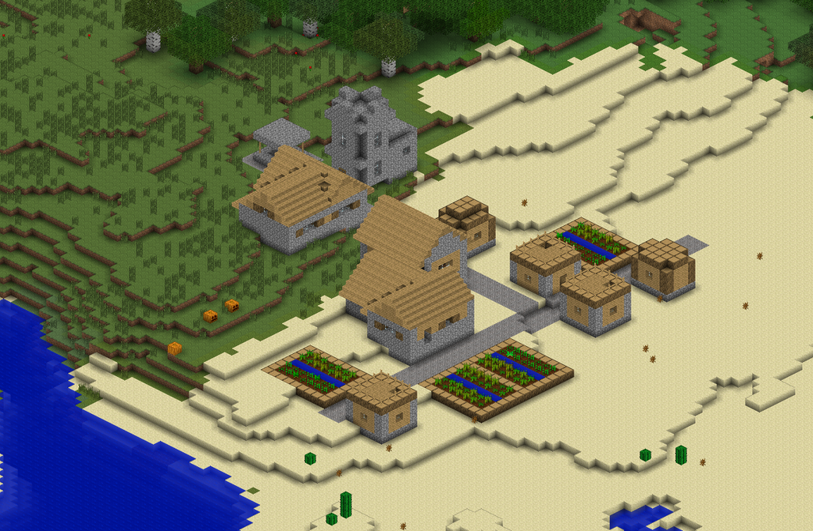

==========
Mapcrafter
==========

Welcome
=======

Mapcrafter is a high performance Minecraft map renderer written in C++. It renders
Minecraft worlds to a bunch of images which are viewable like a Google Map
in any webbrowser using Leaflet.js.

It runs on Linux and other Unix-like operating systems like Mac OS and
has also an experimental support for Windows (see :ref:`installation_windows`).
The renderer works with the Anvil world format and the Minecraft 1.6
resource packs.

Mapcrafter is free software and available under the GPL license. You can access
the latest source code of Mapcrafter on GitHub:
https://github.com/mapcrafter/mapcrafter

There are a few example maps of the renderer on the `GitHub Wiki
<https://github.com/mapcrafter/mapcrafter/wiki/Example-maps>`_.  Please feel free to
add your own map to this list.

Features
========

* **Web output:** Render your Minecraft worlds to maps viewable in any webbrowser!
* **Different render views:** Choose between different perspectives to render your world
  from! A 2D topdown and a 3D isometric render view are available!
* **Different rotations:** Choose from four different rotations to render your worlds from!
* **Different render modes:** Choose between different render modes like day, night and cave 
  for your maps!
* **Different overlays:** Show additional information on your map! For example: Where can
  slimes spawn? Where can monsters spawn at night?
* **Configuration files:** Highly-customizable which worlds are rendered with which render
  view and other render parameters!
* **Markers:** Automatically generated markers from your Minecraft world data!
* **Other stuff:** Biome colors, incremental rendering, multithreading

Help
====

Read :doc:`using_mapcrafter` to get a first insight how to use the renderer.
You can find a detailed documentation about the render configuration file
format in :doc:`configuration`.

If you find bugs or problems when using Mapcrafter or if you have ideas for new
features, then please feel free to add an issue to the `GitHub issue tracker
<https://github.com/mapcrafter/mapcrafter/issues>`_.

You can contact me in IRC (#mapcrafter on Freenode). Use the `webclient
<http://webchat.freenode.net/?channels=mapcrafter>`_ if you are new to IRC. I
will be there most of the time, but please bear in mind that I can't be
available all the time. If I'm not there, wait some time or try another time of
the day.

Documentation Contents
======================

.. toctree::
   :maxdepth: 3
   
   installation
   using_mapcrafter
   configuration
   markers
   blockcrafter
   logging
   hacking

Indices and tables
==================

* :ref:`genindex`
* :ref:`search`

